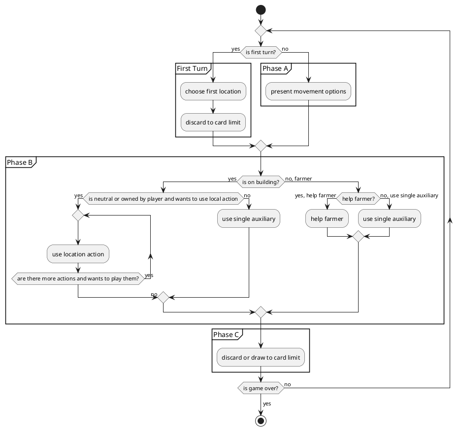

# gwta

Just a "quick" warm-up exercise 😀

## Map

## Player Turn

## Roadmap

- ✅️ Buildings
  - ✅️ Neutral Building A
  - ✅ Neutral Building B
  - ✅ Neutral Building C
  - ✅ Neutral Building D
  - ️✅ Neutral Building E
  - ️✅ Neutral Building F
  - ✅️ Neutral Building G
  - ✅️ Neutral Building H
  - ✅️ Player Building 1A
  - ✅️ Player Building 2A
  - ✅️ Player Building 3A
  - ✅ Player Building 4A
  - ✅ Player Building 5A
  - ✅ Player Building 6A
  - ✅ Player Building 7A
  - ✅ Player Building 8A
  - ✅ Player Building 9A
  - ✅ Player Building 10A
  - ✅ Player Building 1B
  - ✅️ Player Building 2B
  - ✅️ Player Building 3B
  - ✅ Player Building 4B
  - ✅ Player Building 5B
  - ✅ Player Building 6B
  - ✅ Player Building 7B
  - ✅ Player Building 8B
  - ✅ Player Building 9B
  - ✅ Player Building 10B
- ⚠️ Mechanics
  - ⚠️ Movement
    - ❌ leave coin on farmers
    - ❌ pay players when passing over hands
  - ❌ Train Tracks
    - ❌ Station Masters
    - ❌ End of track situations
    - ❌ Move backward
  - ✅ Objective Cards
    - ✅ immediate impact
    - ✅ playable
    - ✅ endgame scoring
  - ⚠️ Buying cow combinations (allow buying of multiple cows and filling cow market)
  - ✅ Grain
  - ✅ Buenos Aires
    - ✅ Extra delivery
    - ✅ Refill cow market
    - ✅ Sail to ports
      - ✅ choose ship from available ships
      - ✅ choose token to upgrade
      - ✅ refill ships when triggered
      - ✅ sail ships
      - ✅ score ships
  - ✅ Actions
    - ✅ Auxiliary
    - ✅ Double Auxiliary
    - ✅ Risk location options
  - ✅ Card and movement limit
  - ✅ Game seeding
    - ✅ Discard start cards > 4
  - ⚠️ Game end
    - ✅ The round is finished after the job market token reaches the end
    - ⚠️ End game scoring
  - ✅ Certificates
    - ✅ player board
    - ✅ buenos aires
  - ✅ Exhaustion cards
    - ✅ buenos aires
    - ✅ player board
    - ✅ end game rating
  - ✅️ Exchange tokens
    - ✅ gain
    - ✅ use as action
  - ⚠️ Hiring workers
    - ✅ should not be possible if player already has 6 of a type
    - ⚠️ hiring effects
      - ❌ last effect of machinist
  - ⚠️ Grain
    - ❌ consistent grain limitation (only present gain grain option if player has less than 8)

## Ideas

### Ideas

- cows
- buildings
- locations
- objectives
- exhaustion cards
- exchange tokens
- workers
- farmers
