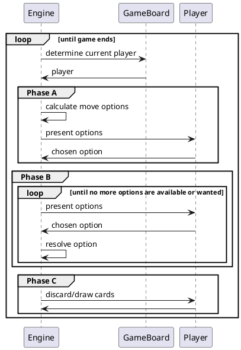

# gwta

Just a "quick" warm-up exercise 😀

## Map

## Player Turn

## Roadmap

- ⚠️ Buildings
  - ✅️ Neutral Building A
  - ✅ Neutral Building B
  - ✅ Neutral Building C
  - ✅ Neutral Building D
  - ️✅ Neutral Building E
  - ️✅ Neutral Building F
  - ✅️ Neutral Building G
  - ✅️ Neutral Building H
  - ✅️ Player Building 1A
  - ✅️ Player Building 2A
  - ✅️ Player Building 3A
  - ✅ Player Building 4A
  - ❌ Player Building 5A (requires ports)
  - ✅ Player Building 6A
  - ✅ Player Building 7A
  - ❌ Player Building 8A (requires ports)
  - ✅ Player Building 9A
  - ✅ Player Building 10A
  - ✅ Player Building 1B
  - ✅️ Player Building 2B
  - ✅️ Player Building 3B
  - ✅ Player Building 4B
  - ✅ Player Building 5B
  - ❌ Player Building 6B
  - ❌ Player Building 7B
  - ✅ Player Building 8B
  - ❌ Player Building 9B
  - ✅ Player Building 10B
- ⚠️ Mechanics
  - ⚠️ Movement
    - ❌ leave coin on farmers
    - ❌ pay players when passing over hands
  - ❌ Loading Ships
  - ❌ Second delivery at port
  - ❌ Train Tracks
    - ❌ Station Masters
    - ❌ End of track situations
  - ⚠️ Objective Cards
  - ⚠️ Buying cow combinations
  - ✅ Grain
  - ❌ Certificates
  - ❌ Buenos Aires
    - ❌ Refill cow market
    - ❌ Sail to ports
  - ⚠️ Actions
    - ⚠️ Auxiliary
    - ⚠️ Double Auxiliary
  - ❌ Card and movement limit
  - ⚠️ Game seeing
    - ❌ Discard start cards > 4
  - ⚠️ Game end
    - ❌ The round is finished after the job market token reaches the end
  - ⚠️ Certificates
    - ✅ player board
    - ❌ buenos aires
  - ⚠️ Exhaustion cards
    - ✅ buenos aires
    - ✅ player board
    - ❌ end game rating
  - ⚠️ Exchange tokens
    - ✅ gain
    - ❌ use as action
