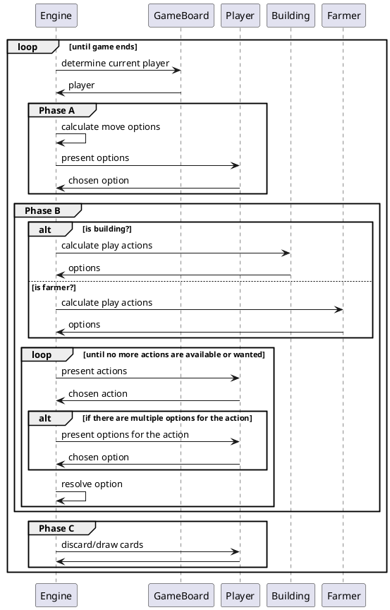

# gwta

Just a "quick" warm-up exercise 😀

## Map


## Design Questions

### Does the player know where they are on the map or does the map know where players are?

- players don't block each other
- map already has a lot to track (although players will have to as well)

## How are building actions handled?

- Nodes have buildings
- my turn
  - I choose a move
  - I choose which option to take if there are multiple
  - I choose which variant of that option I'll take
- but who calculates those options?
  - buildings themselves?
    - they need a lot of information about the game board and the player
  - the engine
    - how does it know what type of action

Example action codes:

- `DiscardCardForGold(type, gold)`
- `HireWorker(modifier)`
- `DrawObjectiveCard()`
- `AuxiliaryAction`
- `DoubleAuxiliaryAction`
- `DiscardTwoEqualCards`
- `MoveTrainByNumberOfMachinists`
- `BuyCows`
- `IncreaseCertificates`
- `HelpUpToThreeFarmers`
- `HelpFarmer`
- `GetOneGrainForEachHiredFarmer`
- `ReturnOneExhaustionCard`
- `GetOneGrainForEachGrainBuilding`
- `MoveUpToXSteps`
- `GetOneExchangeToken`
- `DrawAndDiscardCardsForEachHerder`
- `GainGrain`
- `PlaceATokenOnAHarbor`
- `GetOneCoinForEachGrainBuilding`
- `GetOneCoinForEachHiredFarmer`
- `DiscardAnObjectiveCardForThreeCertificates`
- `GetOneCertificateForTwoHelpedFarmers`
- `GetSixGoldForEachSetOfFourWorkers`
- `ExecuteBuenosAiresStepOne`
- `OneGrainForTwoGoldAndTwoTrainMoves`
- `OneExhaustionCardForEachOpponent`
- `DiscardOneCowTakeOneCowFromTheMarket`

Actions could be combinations over other actions in order to avoid duplication and extra testing effort.

E.g.: `Or(CompoundAction(Discard(HolandoArgentino), GainCoin(2)), HireWorker(0), HireWorker(2))`

Where an action is something that produces options that players can choose from like `Option(): Set<Action>`

So in the previous example this would mean

```bash
# A building
Or # produces CompoundAction, HireWorker, HireWorker
    CompoundAction Discard(HolandoArgentino), GainCoin(2) # produces no sub options because the different options for similar cards are identical
    HireWorker # produces one option for each available & affordable worker
    HireWorker # produces one option for each available & affordable worker

# B building
Or # produces CompoundAction, BuyCows
  CompoundAction Discard(Patagonico), GainCoin(2) # produces no sub options because the different options for similar cards are identical
  BuyCows # produces e.g. with 4 cowboys and a lot of coin and unlimited market (usually this will drastically restrict the options)
    # buy 4x Caracu
    # buy 4x value 3 cards for 5 each
    # buy 4x Franqueiro for 11 each
    # buy 2x value 3 cards for 2 each
    # buy 2x Aberdeen-Angus for 11 each
    # buy 1x Aberdeen-Angus for 6 each
    # buy 1x Franqueiro and 1x Caracu
    # buy 1x Franqueiro and 1x value 3 card
    # buy 1x Franqueiro and draw two more cowboys
    # draw 8 more cowboys
    # draw 6 more cowboys and buy one Caracu
    # draw 6 more cowboys and buy one value 3 card
    # draw 4 more cowboys and buy 2x Caracu
    # draw 4 more cowboys and buy 2x value 3 card
    # draw 4 more cowboys and buy 1x Aberdeen-Angus
    # draw 4 more cowboys and buy 1x Franquiero and 1x Caracu
    # draw 2 more cowboys
    # ...

So depending on how many herders one has, what is in the market and how much coin the player has, there can be a lot of options especially since only using some cowboys and not all of them in order to save money for other things is very much valid.
```

How about actions that need to be resolved in one, like in the most complex case, discard any cow card and get any card from the cow market. That would result in up to 6 (upgraded hand) card options to discard and up to 15 different cards to get (full 4 player market) i.e. 6 x 15 = 90 options (of which probably only less than 10% make sense).

=> Let's just implement it like this for now as a set of tuples of all actions.

```
Phase B
    -> I chose a location
    -> there are three possible actions
    -> the location presents these as
        1 2 3, 1 3 2, 2 1 3, 2 3 1, 3 1 2, 3 2 1, 1 2, 1 3, 2 1, 2 3, 3 1, 3 2, 1, 2, 3
        mostly it would be as simple as
        1 2, 2 1, 1, 2
        in the case of e.g. H it would be because 2 and 3 are exclusive
        1 2, 1 3, 2 1, 3 1
        usually the order wouldn't make a difference but 3 is an auxiliary action so it would look like
        1 2, 2 1, 1 a, 1 b, 1 c, 1 d, 1 e, 1 f
        ⚠️ the location doesn't actually need to calculate these unless it involves further movements ⚠️
        ⚡ Not completely true, because some options would have a very high number of options ⚡️
    -> the engine checks which are available to the user and lets them choose
    -> should the building just produce all possibilities and the engines then checks which are possible?
        -> advantage is that the building could decide if it makes sense to even suggest a certain option e.g. in 10a it never makes sense to move the train before taking the coin and the grain (due to possible costs for station masters)
```

Still wondering 🤔 is it possible to calculate all possible options based on the state of the game before the first action?
In theory yes, but practically speaking this would lead to a crazy amount of actions and possibilities, because of the chance of playing
objective and trade tokens.

=> So it's better to go back to doing small actions and keep doing so until the player has exhausted all possible actions.

Example for neutral building A:

- choose between: exchange token, objective card, action 1, action 2, action 3
- _objective card_
- choose between: exchange token, action 1, action 2, action 3
- _exchange token_
- choose between: action 1, action 2, action 3
- _action 1_
- ...



### Actions

Some actions are easier to implement than others. I'll try to sum them up here.

#### Moving trains

Similar to map, should be easy to do.

#### Buying cows

Requires hand cards and possible coins as well.
After that it's easy.
Reseed during Buenos Aires events.

#### Building buildings

Very easy, the actions are the only hard thing, but that's not part of the task for building.

#### Help a farmer

Easy in itself, but need to think about how to validate things properly.

#### Discarding for coin

Easy, but requires cows.

#### Hiring a worker

Easy, except for the actions when hiring, those require other things to be implemented. Maybe split the task up.

#### Draw bonus cards

Drawing is easy, but implementing them should be done here as well.

## Roadmap

- Buildings
  - ⚠️ Neutral Building A
  - ⚠️ Neutral Building B
  - ❌ Neutral Building C
  - ❌ Neutral Building D
  - ❌ Neutral Building E
  - ❌ Neutral Building F
  - ❌ Neutral Building G
  - ❌ Neutral Building H
  - ❌ Player Building 1A
  - ❌ Player Building 2A
  - ❌ Player Building 3A
  - ❌ Player Building 4A
  - ❌ Player Building 5A
  - ❌ Player Building 6A
  - ❌ Player Building 7A
  - ❌ Player Building 8A
  - ❌ Player Building 9A
  - ❌ Player Building 10A
  - ❌ Player Building 1B
  - ❌ Player Building 2B
  - ❌ Player Building 3B
  - ❌ Player Building 4B
  - ❌ Player Building 5B
  - ❌ Player Building 6B
  - ❌ Player Building 7B
  - ❌ Player Building 8B
  - ❌ Player Building 9B
  - ❌ Player Building 10B
