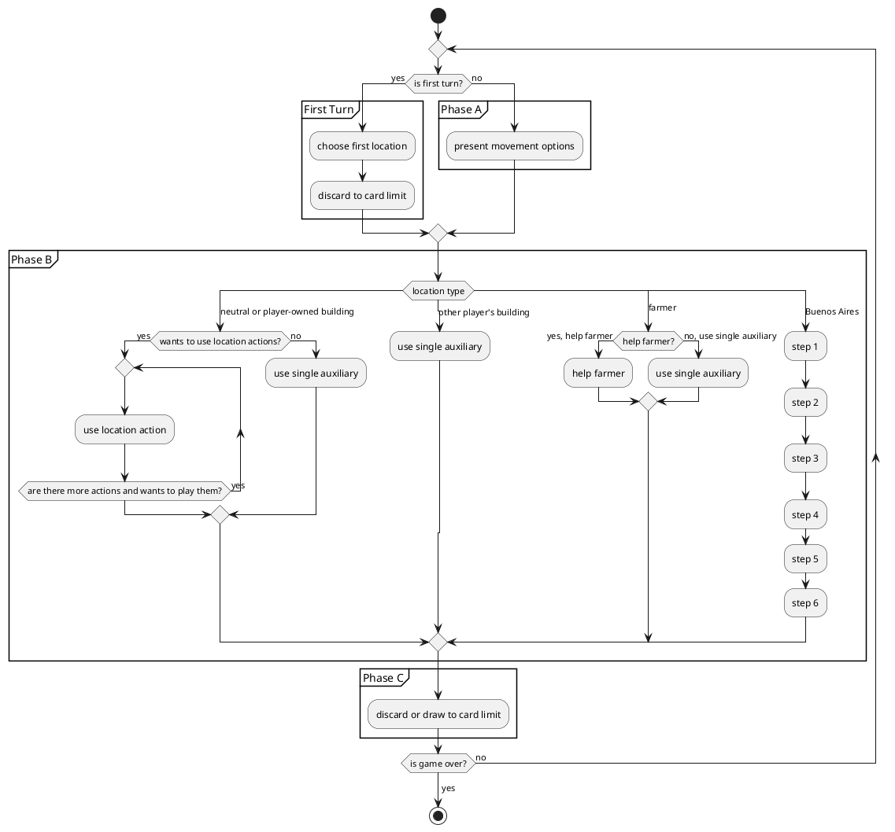

# gwta

Just a "quick" warm-up exercise 😀

## Map


## Player Turn



### Dummy Code for option handling

```
do
    (re-)calculate options
    filter options that have already been taken
    if options contain only location options or are move options and player has objective cards
        add objective card options
    if player has exchange tokens
        add exchange tokens to options
    if option is not an exchange token or objective card
        add passing option
    resolve option
    add option id to options taken
while there are sub options or player passes
```

## Roadmap

- ✅️ Buildings
  - ✅️ Neutral Building A
  - ✅ Neutral Building B
  - ✅ Neutral Building C
  - ✅ Neutral Building D
  - ️✅ Neutral Building E
  - ️✅ Neutral Building F
  - ✅️ Neutral Building G
  - ✅️ Neutral Building H
  - ✅️ Player Building 1A
  - ✅️ Player Building 2A
  - ✅️ Player Building 3A
  - ✅ Player Building 4A
  - ✅ Player Building 5A
  - ✅ Player Building 6A
  - ✅ Player Building 7A
  - ✅ Player Building 8A
  - ✅ Player Building 9A
  - ✅ Player Building 10A
  - ✅ Player Building 1B
  - ✅️ Player Building 2B
  - ✅️ Player Building 3B
  - ✅ Player Building 4B
  - ✅ Player Building 5B
  - ✅ Player Building 6B
  - ✅ Player Building 7B
  - ✅ Player Building 8B
  - ✅ Player Building 9B
  - ✅ Player Building 10B
- ⚠️ Mechanics
  - ⚠️ Movement
    - ❌ leave coin on farmers
    - ❌ pay players when passing over hands
  - ❌ Train Tracks
    - ❌ Station Masters
    - ❌ End of track situations
    - ❌ Move backward
  - ✅ Objective Cards
    - ✅ immediate impact
    - ✅ playable
    - ✅ endgame scoring
  - ⚠️ Buying cow combinations (allow buying of multiple cows and filling cow market)
  - ✅ Grain
  - ✅ Buenos Aires
    - ✅ Extra delivery
    - ✅ Refill cow market
    - ✅ Sail to ports
      - ✅ choose ship from available ships
      - ✅ choose token to upgrade
      - ✅ refill ships when triggered
      - ✅ sail ships
      - ✅ score ships
  - ✅ Actions
    - ✅ Auxiliary
    - ✅ Double Auxiliary
    - ✅ Risk location options
  - ✅ Card and movement limit
  - ✅ Game seeding
    - ✅ Discard start cards > 4
  - ⚠️ Game end
    - ✅ The round is finished after the job market token reaches the end
    - ⚠️ End game scoring
  - ✅ Certificates
    - ✅ player board
    - ✅ buenos aires
  - ✅ Exhaustion cards
    - ✅ buenos aires
    - ✅ player board
    - ✅ end game rating
  - ✅️ Exchange tokens
    - ✅ gain
    - ✅ use as action
  - ⚠️ Hiring workers
    - ✅ should not be possible if player already has 6 of a type
    - ⚠️ hiring effects
      - ❌ last effect of machinist
  - ⚠️ Grain
    - ❌ consistent grain limitation (only present gain grain option if player has less than 8)

## Ideas

### Ideas

- cows
- buildings
- locations
- objectives
- exhaustion cards
- exchange tokens
- workers
- farmers
